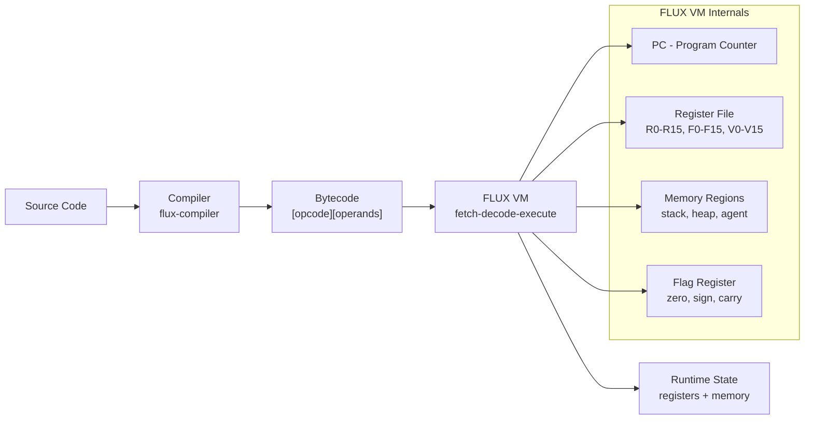

# FLUX ISA Cheat Sheet

> **Your 30-minute guide to FLUX bytecode programming**

FLUX (Fluid Language Universal eXecution) is a bytecode ISA designed for agent runtimes. Think of it as the "DNA" that runs on the FLUX VM — compact, portable, and agent-aware.

---

## 1. What is FLUX?

### Purpose
FLUX is a **bytecode instruction set architecture** (ISA) for agent-based AI systems. Instead of compiling to x86 machine code, code compiles to FLUX bytecode which runs on the FLUX VM. This makes programs portable across any platform with a FLUX implementation (C, Rust, Zig, Python, JavaScript, WASM, CUDA, etc.).

### What Problems It Solves
| Problem | FLUX Solution |
|---------|---------------|
| Agents need portable code | Bytecode runs everywhere |
| Token overhead of text code | FLUX bytecode is 5-20x smaller than equivalent Python/JS |
| Cross-language agent coordination | Same bytecode, any language runtime |
| Memory-safe execution | Capability-based memory regions |
| Speculative execution | `CLONE`/`ROLLBACK`/`PEEK` for agent experimentation |

### Why It Exists
FLUX was born from building AI agent systems across 11 different language implementations. Each time, teams rewrote the same fetch-decode-execute loop. FLUX standardizes the bytecode format so agent code written once runs everywhere.

---

## 2. Architecture

### Pipeline

```
┌──────────────┐     ┌──────────────┐     ┌───────────────┐     ┌─────────────┐     ┌─────────────┐
│ Source Code  │ ──▶ │   Compiler   │ ──▶ │   Bytecode    │ ──▶ │     VM      │ ──▶ │   Runtime   │
│ (Any Lang)   │     │ (flux-compiler)│    │   (.bin)      │     │ (flux-vm)   │     │  (Result)   │
└──────────────┘     └──────────────┘     └───────────────┘     └─────────────┘     └─────────────┘
     Plane 5             Plane 2            Binary             Interpreter        System State
  (Natural Lang)       (Bytecode)          Format               Loop              (Output)
```

### Mermaid Diagram



### Bytecode File Format

```
┌─────────────────────────────────────────────────────────┐
│  18-byte Header                                          │
│  magic: FLUX (4) | version (2) | flags (2) | entry (4)  │
├─────────────────────────────────────────────────────────┤
│  Instruction Stream                                     │
│  [opcode][operand bytes...]                             │
│  [opcode][operand bytes...]                             │
│  ...                                                     │
└─────────────────────────────────────────────────────────┘
```

---

## 3. Core Concepts

### Register File

| Register | Type | Count | Purpose |
|----------|------|-------|---------|
| `R0`–`R15` | int32 | 16 | General purpose integers |
| `F0`–`F15` | float | 16 | Floating point |
| `V0`–`V15` | 128-bit SIMD | 16 | Vector/SIMD operations |
| `SP` (R11) | int32 | 1 | Stack pointer (grows down) |
| `FP` (R14) | int32 | 1 | Frame pointer |
| `LR` (R15) | int32 | 1 | Link register (return addr) |

> **Note:** In the Rust `flux-bytecode` crate, registers are `A0`–`A7` (general), `F0`–`F7` (float), `C0`–`C3` (control/flags).

### Memory Regions

FLUX has **capability-based memory** — regions with names and types:

| Region | Purpose | Access |
|--------|---------|--------|
| `stack` | Function calls, locals | Grows down from top |
| `heap` | Dynamic allocation | Manual via `ALLOC`/`FREE` |
| `agent` | Agent-owned data | Capability-gated |

### Instruction Formats

There are **6 encoding formats** (A through G):

| Format | Name | Size | Operands | Used By |
|--------|------|------|----------|---------|
| **A** | Nullary | 1 byte | None | `HALT`, `NOP`, `RET`, `YIELD` |
| **B** | Register | 3 bytes | `dst, src` | `MOV`, `PUSH`, `POP`, `ADD` |
| **C** | Reg+Type | 4 bytes | `dst, src, type` | Arithmetic with type tags |
| **D** | Immediate | 4 bytes | `dst, imm16` | `MOVI`, `ADDI`, `IINC` |
| **E** | Memory | 5 bytes | `dst, base, offset` | `LOAD`, `STORE` with offset |
| **G** | Variable | 2+N bytes | `len, payload` | `CALL`, `JMP`, `REGION_CREATE` |

**Format A (1 byte):**
```
[opcode]
```

**Format B (3 bytes):**
```
[opcode][dst][src]
```

**Format D (4 bytes):**
```
[opcode][dst][imm_lo][imm_hi]   // imm16 is little-endian
```

---

## 4. Top 20 Opcodes

### Control Flow

| Hex | Name | Format | Description | Example |
|-----|------|--------|-------------|---------|
| `0x00` | `HALT` | A | Stop execution, return R0 | `[0x00]` |
| `0x01` | `NOP` | A | Do nothing | `[0x01]` |
| `0x03` | `JMP` | G | Unconditional jump (relative offset) | `[0x03][2][off_lo][off_hi]` |
| `0x04` | `JIZ` | G | Jump if top-of-stack == 0 | `[0x04][2][off_lo][off_hi]` |
| `0x05` | `JINZ` | G | Jump if top-of-stack != 0 | `[0x05][2][off_lo][off_hi]` |
| `0x06` | `CALL` | G | Call function (push PC, jump) | `[0x06][2][idx_lo][idx_hi]` |
| `0x02` | `RET` | A | Return from function (pop PC) | `[0x02]` |

### Register/Stack Operations

| Hex | Name | Format | Description | Example |
|-----|------|--------|-------------|---------|
| `0x10` | `PUSH` | B | Push register onto stack | `[0x10][Rd][0]` |
| `0x11` | `POP` | B | Pop stack into register | `[0x11][Rd][0]` |
| `0x12` | `DUP` | B | Duplicate top-of-stack | `[0x12][0][0]` |
| `0x3A` | `MOV` | B | Copy src register to dst | `[0x3A][Rd][Rs]` |

### Integer Arithmetic

| Hex | Name | Format | Description | Example |
|-----|------|--------|-------------|---------|
| `0x21` | `ADD` | B | `Rd = Rd + Rs` | `[0x21][Rd][Rs]` |
| `0x22` | `SUB` | B | `Rd = Rd - Rs` | `[0x22][Rd][Rs]` |
| `0x23` | `MUL` | B | `Rd = Rd * Rs` | `[0x23][Rd][Rs]` |
| `0x24` | `DIV` | B | `Rd = Rd / Rs` | `[0x24][Rd][Rs]` |
| `0x25` | `MOD` | B | `Rd = Rd % Rs` | `[0x25][Rd][Rs]` |
| `0x09` | `DEC` | B | `Rd = Rd - 1` | `[0x09][Rd][0]` |
| `0x08` | `INC` | B | `Rd = Rd + 1` | `[0x08][Rd][0]` |

### Immediate Arithmetic

| Hex | Name | Format | Description | Example |
|-----|------|--------|-------------|---------|
| `0x18` | `MOVI` | D | `Rd = imm16` (load immediate) | `[0x18][Rd][7][0]` → R0=7 |
| `0x19` | `ADDI` | D | `Rd = Rd + imm16` | `[0x19][Rd][1][0]` → R0+=1 |

### Memory

| Hex | Name | Format | Description | Example |
|-----|------|--------|-------------|---------|
| `0x38` | `LOAD` | E | `Rd = memory[Rs + offset]` | `[0x38][Rd][Rb][off_lo][off_hi]` |
| `0x39` | `STORE` | E | `memory[Rd + offset] = Rs` | `[0x39][Rb][Rs][off_lo][off_hi]` |

### Comparison & Flags

| Hex | Name | Format | Description | Example |
|-----|------|--------|-------------|---------|
| `0x2C` | `CMP_EQ` | B | Set flags: `Rd == Rs` | `[0x2C][Rd][Rs]` |
| `0x2D` | `CMP_LT` | B | Set flags: `Rd < Rs` | `[0x2D][Rd][Rs]` |
| `0x2E` | `CMP_GT` | B | Set flags: `Rd > Rs` | `[0x2E][Rd][Rs]` |
| `0x2F` | `CMP_NE` | B | Set flags: `Rd != Rs` | `[0x2F][Rd][Rs]` |

### Bitwise

| Hex | Name | Format | Description | Example |
|-----|------|--------|-------------|---------|
| `0x25` | `AND` | B | `Rd &= Rs` | `[0x25][Rd][Rs]` |
| `0x26` | `OR` | B | `Rd \|= Rs` | `[0x26][Rd][Rs]` |
| `0x27` | `XOR` | B | `Rd ^= Rs` | `[0x27][Rd][Rs]` |
| `0x28` | `SHL` | B | `Rd <<= Rs` | `[0x28][Rd][Rs]` |
| `0x29` | `SHR` | B | `Rd >>= Rs` (arithmetic) | `[0x29][Rd][Rs]` |

### Float

| Hex | Name | Format | Description | Example |
|-----|------|--------|-------------|---------|
| `0x30` | `FADD` | B | `Fd = Fd + Fs` | `[0x30][Fd][Fs]` |
| `0x32` | `FMUL` | B | `Fd = Fd * Fs` | `[0x32][Fd][Fs]` |

---

## 5. Hello World in FLUX Bytecode

### The Minimal Program

```python
# Python: emit bytecode for printing "42"
from flux_compiler import BytecodeEncoder, Op

enc = BytecodeEncoder()

# MOVI R0, 42     ; load immediate 42 into R0
enc.emit(Instruction.imm(Op::MOVI, 0, 42))

# HALT            ; stop, return R0 as exit code
enc.emit(Instruction.nullary(Op::HALT))

bytecode = enc.finish(header)
```

### Equivalent Bytecode (Hex)

```
18 00 2A 00   ; MOVI R0, 42  (R0 = 42)
00            ; HALT         (stop, R0=42 is return value)
```

### Fibonacci in Bytecode

```c
// C: Fibonacci(10) in FLUX ISA v2 bytecode
// Bytes: [opcode, rd, rs1, rs2] — 4 bytes each
uint8_t code[] = {
    0x18, 0x00, 0x01, 0x00,  // MOVI R0, 1    // R0 = a = 1
    0x18, 0x01, 0x01, 0x00,  // MOVI R1, 1    // R1 = b = 1
    0x18, 0x02, 0x0A, 0x00,  // MOVI R2, 10   // R2 = count = 10
    0x22, 0x03, 0x00, 0x01,  // ADD R3, R0, R1  // R3 = a + b
    0x3A, 0x00, 0x01, 0x00,  // MOV R0, R1    // a = b
    0x3A, 0x01, 0x03, 0x00,  // MOV R1, R3    // b = R3
    0x09, 0x02, 0x00, 0x00,  // DEC R2        // count--
    0x05, 0x02, 0xF4, 0xFF,  // JINZ R2, -12  // if R2 != 0, jump -12
    0x00, 0x00, 0x00, 0x00   // HALT          // return R0 = 55
};
```

### Step-by-Step Trace

```
PC=0:  MOVI R0, 1     → R0=1, R1=1, R2=10
PC=8:  ADD  R3, R0, R1 → R3=2
PC=12: MOV  R0, R1     → R0=1
PC=16: MOV  R1, R3     → R1=2
PC=20: DEC  R2         → R2=9
PC=24: JINZ R2, -12    → 9≠0, jump to PC=12
       (loop 9 more times)
PC=24: JINZ R2, -12    → R2=0, fall through
PC=28: HALT           → return R0=55
```

---

## 6. Writing a Custom Opcode — Step by Step

### Example: `ABS` (integer absolute value)

This opcode doesn't exist yet. Let's add it.

### Step 1: Choose Your Opcode Number

Check the existing opcode map in `flux-runtime-c/include/flux/opcodes.h`.

Available range: look for gaps. Let's use `0x5A` for `ABS`.

```c
// flux-runtime-c/include/flux/opcodes.h
typedef enum {
    // ... existing opcodes ...
    FLUX_ABS = 0x5A,    // NEW: integer absolute value
    // ... 
} FluxOpcode;
```

### Step 2: Add to the Rust Encoder

```rust
// flux/crates/flux-bytecode/src/opcodes.rs
#[repr(u8)]
#[derive(Debug, Clone, Copy)]
pub enum Op {
    // ... existing ...
    
    /// Integer absolute value. Format C.
    Abs = 0x5A,
}
```

And register the format:

```rust
// flux/crates/flux-bytecode/src/opcodes.rs
impl Op {
    pub fn format(self) -> InstrFormat {
        match self {
            Op::Abs => InstrFormat::C,  // dst, src, unused
            // ... other opcodes ...
        }
    }
    
    pub fn name(self) -> &'static str {
        match self {
            Op::Abs => "ABS",
            // ... other names ...
        }
    }
}
```

### Step 3: Add to the Rust Encoder

```rust
// flux/crates/flux-bytecode/src/encoder.rs
impl BytecodeEncoder {
    pub fn encode_abs(&mut self, dst: u8, src: u8) -> Result<(), EncodeError> {
        self.emit(&Instruction::reg_ty(Op::Abs, dst, src, 0))
    }
}
```

Helper constructor:

```rust
// flux/crates/flux-bytecode/src/instruction.rs
impl Instruction {
    pub fn abs(dst: u8, src: u8) -> Self {
        Self::reg_ty(Op::Abs, dst, src, 0)
    }
}
```

### Step 4: Add to the C VM

```c
// flux-runtime-c/src/vm.c
switch(op) {
    // ... existing cases ...
    
    case FLUX_ABS: {
        rd = gr8(v); rs1 = gr8(v);
        GPR[rd] = GPR[rd] < 0 ? -GPR[rd] : GPR[rd];
        sf(v, GPR[rd]);
        break;
    }
    
    // ... 
}
```

### Step 5: Test It

```c
// flux-runtime-c/tests/test_isa_v2_ext.c
void test_abs() {
    ISA2VM vm;
    uint8_t code[] = {
        ISA2_MOVI, 0, -5, 0,    // R0 = -5
        ISA2_ABS,  0, 0, 0,     // R0 = ABS(R0) = 5
        ISA2_HALT, 0, 0, 0
    };
    int32_t r = isa2_execute(&vm, code, sizeof(code));
    assert(r == 5);
    printf("PASS abs: |-5| = %d\n", r);
}
```

Run: `make test`

---

## 7. Extending the Compiler (Rust Encoder)

### Adding a New Opcode to `flux-bytecode`

The Rust encoder lives in `flux/crates/flux-bytecode/src/encoder.rs`.

**File: `flux-bytecode/src/opcodes.rs`**
```rust
#[repr(u8)]
#[derive(Debug, Clone, Copy, PartialEq)]
pub enum Op {
    // ── Existing opcodes ──────────────────────────────
    
    /// Integer absolute value. Format C.
    /// Encoded as: [ABS][dst][src][0]
    Abs = 0x5A,
}

impl Op {
    pub fn format(self) -> InstrFormat {
        match self {
            Op::Abs => InstrFormat::C,  // 4 bytes: [opcode, dst, src, type=0]
            // ... match all other opcodes
        }
    }
    
    pub fn name(self) -> &'static str {
        match self {
            Op::Abs => "ABS",
            // ... all names
        }
    }
}
```

**File: `flux-bytecode/src/encoder.rs`**

The encoder already handles formats generically via `Instruction::emit()`. No per-opcode code needed — just define the `Op` variant and its format.

**Helper methods** (optional but nice):
```rust
impl BytecodeEncoder {
    /// Emit ABS instruction: Rd = |Rs|
    pub fn emit_abs(&mut self, dst: u8, src: u8) -> Result<(), EncodeError> {
        self.emit(&Instruction::reg(Op::Abs, dst, src))
    }
}
```

**Tests:**
```rust
#[test]
fn emit_abs() {
    let mut enc = BytecodeEncoder::new();
    enc.emit(&Instruction::reg(Op::Abs, 5, 3)).unwrap();
    let bytes = enc.into_bytes();
    assert_eq!(bytes, vec![0x5A, 0x05, 0x03]);
}
```

---

## 8. Extending the VM (C Runtime)

### The Dispatch Loop

The VM in `flux-runtime-c/src/vm.c` uses a switch-based fetch-decode-execute loop:

```c
int64_t flux_vm_execute(FluxVM* v) {
    v->running = 1;
    
    while (v->running && v->cycle_count < v->max_cycles) {
        uint8_t op = v->bytecode[v->regs.pc++];  // FETCH
        
        switch(op) {  // DECODE + EXECUTE
        case FLUX_NOP: break;
        case FLUX_ABS: {
            uint8_t rd = gr8(v), rs1 = gr8(v);
            int32_t val = GPR[rd];
            GPR[rd] = val < 0 ? -val : val;
            sf(v, GPR[rd]);  // set zero/sign flags
            break;
        }
        // ... other cases ...
        }
    }
    return v->regs.gp[0];  // return value
}
```

### Helper Macros

```c
// Read a register index (validates 0-15)
#define gr8(v) ({ uint8_t r=v->bytecode[v->regs.pc++]; r<16?r:0; })

// Read a signed 16-bit immediate (little-endian)
static inline int16_t fi16(FluxVM* v) {
    uint8_t l = v->bytecode[v->regs.pc++];
    uint8_t h = v->bytecode[v->regs.pc++];
    return (int16_t)(l | (h << 8));
}

// Set arithmetic flags
static inline void sf(FluxVM* v, int32_t r) {
    v->flag_zero = (r == 0);
    v->flag_sign = (r < 0);
}
```

### Memory Regions

```c
// Create a named memory region
flux_mem_create(&v->mem, "stack", 65536, "system");

// Read/write memory
int32_t val = flux_mem_read_i32(region, offset);
flux_mem_write_i32(region, offset, val);
```

### Error Handling

```c
#define ERR(e) do { \
    v->last_error = (e); \
    v->running = 0; \
    return -(int64_t)(e); \
} while(0)

// Error codes:
// 1 = HALT, 3 = DIV_ZERO, 4 = STACK_OVERFLOW, 5 = INVALID_OPCODE
```

---

## 9. Common Pitfalls

### 1. Off-by-One in Jump Offsets

**Wrong:**
```c
// JNZ R2, -12  ← pc is already past the opcode when we compute offset
code[pc] = ISA2_JNZ; code[pc+1] = 2;
code[pc+2] = (offset & 0xFF);
code[pc+3] = ((offset >> 8) & 0xFF);
```

**Correct:** The offset is relative to the **next instruction**:
```c
int offset = loop_pc - (pc + 4);  // +4 to skip past JNZ itself
```

### 2. Endianness on Immediates

FLUX uses **little-endian** for all 16-bit and 32-bit immediates.

```c
// WRONG:  MOVI R0, 256  →  [0x18][0][0x00][0x01]
// This loads 256 (0x0100) correctly in little-endian

// CORRECT: MOVI R0, 256  →  [0x18][0][0x00][0x01]
//          MOVI R0, 256  →  [0x18][0][0x00][0x01] ✓

// WRONG:   MOVI R0, 256  →  [0x18][0][0x01][0x00] ✗
// This loads 1 (0x0001) instead!
```

### 3. Stack Pointer Direction

The stack **grows down** (SP starts high, decreases on push).

```c
// WRONG: Pushing without adjusting SP down first
v->regs.sp += 4;  // ← grows UP (wrong!)
flux_mem_write_i32(s, v->regs.sp, val);

// CORRECT: SP goes DOWN on push
v->regs.sp -= 4;  // grow down
flux_mem_write_i32(s, v->regs.sp, val);
```

### 4. Divide by Zero

Always check before `DIV`/`MOD`:

```c
case FLUX_DIV: {
    if (GPR[rs1] == 0) ERR(FLUX_ERR_DIV_ZERO);
    GPR[rd] /= GPR[rs1];
    break;
}
```

### 5. Register Validation

Validate register IDs against `FLUX_GP_COUNT` (16):

```c
// Safe register reader
static inline uint8_t gr8(FluxVM* v) {
    uint8_t r = v->bytecode[v->regs.pc++];
    return r < FLUX_GP_COUNT ? r : 0;  // clamp to R0 if invalid
}
```

### 6. Forgetting to Set Flags

After arithmetic, always update flags:

```c
case FLUX_ADD: {
    int32_t r = GPR[rd] + GPR[rs1];
    sf(v, r);      // ← SET FLAGS (zero/sign)
    GPR[rd] = r;
    break;
}
```

### 7. Format Mismatches

Match the format to the opcode's definition:

| Opcode | Format | Encoding |
|--------|--------|----------|
| `HALT` | A | `[0x00]` |
| `ADD` | B | `[opcode][rd][rs]` |
| `MOVI` | D | `[opcode][rd][imm_lo][imm_hi]` |
| `LOAD` | E | `[opcode][rd][rb][off_lo][off_hi]` |

---

## 10. Links & Resources

### Specification
- **FLUX ISA v2 Spec:** `flux-runtime-c/ISA-FIX-SPEC.md`
- **Full Opcode List:** `flux-runtime-c/include/flux/opcodes.h`
- **Format Reference:** `flux/crates/flux-bytecode/src/format.rs`

### Reference Implementations

| Language | Repo | Notes |
|----------|------|-------|
| **C (fastest)** | `SuperInstance/flux-runtime-c` | 210 ns/iter, zero deps, ARM64 safe |
| **Rust** | `SuperInstance/flux/crates/flux-vm` | Zero dependencies, safe Rust |
| **Python** | `SuperInstance/flux-runtime` | Reference impl, easier to read |
| **JavaScript** | `flux-runtime-js` | V8 JIT friendly, 373 ns/iter |
| **Go** | `flux-swarm-go` | Goroutine-based agent swarm |
| **WASM** | `flux-runtime-wasm` | Browser-native execution |

### Tests
```
flux-runtime-c/tests/
├── test_isa_v2.c      # Core ISA tests (MOVI, ADD, JNZ, factorial)
├── test_asm.c         # Assembly output tests
├── test_memory.c      # Memory region tests
└── test_runtime.c     # Full program tests

flux/crates/flux-vm/src/
└── tests/             # Rust VM tests
```

### Compilers
```
flux-compiler/          # 6-plane abstraction compiler
├── Plane 5: Intent (natural language)
├── Plane 4: Domain vocabulary
├── Plane 3: IR (JSON AST)
├── Plane 2: FLUX bytecode  ← your target
├── Plane 1: Native (C/Rust/Zig)
└── Plane 0: Metal (assembly)
```

### Quick Start

```bash
# Build the C VM
cd flux-runtime-c && make

# Run tests
make test    # 27+ tests

# Execute bytecode
./flux-vm-cli program.bin

# Python: emit bytecode
pip install flux-compiler-agentic
python -c "
from flux_compiler import BytecodeEncoder, Op, Instruction
enc = BytecodeEncoder()
enc.emit(Instruction.imm(Op.MOVI, 0, 42))
enc.emit(Instruction.nullary(Op.HALT))
print(enc.finish().hex())
"
# Output: 18002a0000
```

---

*Built from 11 implementation lessons. FLUX: the mitochondrion made manifest.*