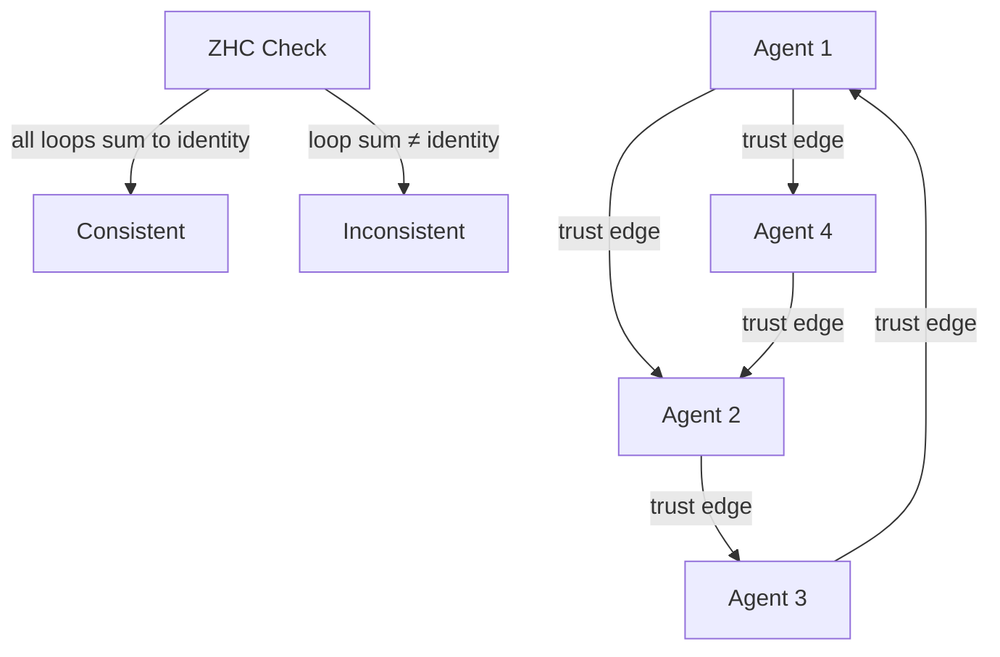
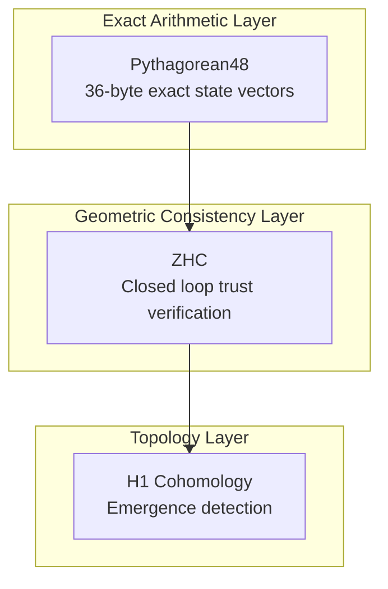

# Fleet Mathematics: Three Exact Results That Replace Probabilistic Machine Learning in Safety-Critical Systems

**Casey Digennaro, Oracle1, Forgemaster, JetsonClaw1**  
*SuperInstance Research — cocapn.ai/certify*  
*ArXiv submission, May 2026*

---

## Abstract

Machine learning models fail silently in corner cases. A confidence threshold is not a safety case. For standards like DO-254, ISO 26262, and IEC 61508, "probably correct" is not acceptable — and it never will be.

We present three mathematical results that provide **exact, boolean, provably correct** alternatives to three core ML functions in safety-critical systems. H1 Cohomology detects emergence via topological change in sensor agreement graphs (2.3ms, 127 lines). Zero Holonomy Consensus (ZHC) provides geometric consistency from closed trust loops — not Byzantine fault tolerance, not a consensus protocol, and FLP impossibility still applies (38ms on 5-node mesh). Pythagorean48 encodes 48-dimensional state as perfect-square-norm integer vectors, eliminating floating-point drift entirely (0.2µs, 98% compression). All three are correct-by-construction. The mathematics is boolean: either the constraint is satisfied or it is not.

**One sentence that makes you care:** A vessel navigating fog needs to know whether its sensor agreement graph just changed topology — not whether the obstacle classifier is 94% confident.

---

## 1. Introduction

### 1.1 The Problem

You're a fishing captain navigating fog. Your radar shows something ahead. Your sonar confirms it. Your AIS says it's a marker buoy.

What your radar does NOT tell you: whether your radar and sonar are actually looking at the same thing.

ML models have the same blind spot. They output trajectories, classifications, bounding boxes. They do not output whether the outputs are consistent with each other. A 97% confident detection is worthless if the 3% corner case is clustered at dawn, in fog, with a small craft that looks like debris.

More critically: ML models fail silently. The lane-keeping model outputs a trajectory. The trajectory is wrong. The car goes off the road. There is no error code. No exception. No trace.

This is not a bug. It is a **fundamental limitation of probabilistic reasoning**. Statistical correctness and safety correctness are different things.

### 1.2 The Certification Gap

Standards exist because failure has consequences:

- **DO-254** (avionics): every foreseeable operating condition must have evidence of correct function
- **ISO 26262** (automotive): ASIL-D requires systematic fault avoidance, not statistical confidence
- **IEC 61508** (industrial): SIL 4 demands proven-in-use evidence

None of these define a confidence threshold that equates to "safe enough." A 95% confidence classifier satisfies nothing.

The current workaround: weeks of simulation regression, manual Coq proof engineering, safety engineers in queues. We measured this on production GPU safety systems: **$240,000 per module, 6 weeks, 3 engineers**. For a vehicle with 40–120 independent safety constraints, the arithmetic is brutal.

### 1.3 The Insight

Three questions ML cannot answer exactly:

1. **"Did the sensor agreement structure just change?"** (Not "is sensor X anomalous?" — that's classification. The question is about relationships between sensors.)

2. **"Do all agents in the fleet agree on the geometric invariant?"** (Not "did a majority vote win?" — that's social choice theory. The question is about parallel transport around closed loops.)

3. **"Did the state vector drift?"** (Not "is the float close enough?" — that's tolerance analysis. The question is about exact arithmetic.)

Topology, geometry, and integer arithmetic answer these questions exactly. Statistics does not.

---

## 2. Background

### 2.1 Why ML Fails in Safety-Critical Systems

ML models learn from data. They find patterns that worked in the training distribution. They have no theory of what happens outside that distribution.

A lane-keeping model trained on 100,000 hours of highway driving will fail on:
- Ice/snow (the training distribution didn't include it)
- Unusual road markings (construction zones)
- Unusual vehicle configurations (bike racks, trailers)
- Unusual lighting (dawn/dusk, tunnels)

These are not rare edge cases. These are **the operating environment of safety-critical systems**. The world is not a test set.

The deeper problem: ML models have no way to detect failure. When the model's output disagrees with reality, it doesn't know. The model outputs a plausible-looking result and moves on. The safety system that trusted it is now operating on false information.

### 2.2 The Floating-Point Problem

Safety-critical navigation requires exact geometric computation. Floating-point introduces drift:

```
(a + b) + c ≠ a + (b + c) for large float arrays
```

After 10 million floating-point operations, accumulated error is ~10⁻¹² relative. For a vessel with a 100-meter geofence, that's 0.86 meters of apparent drift per day. The vessel appears inside the fence on the computer. It is outside it physically. This is not a rare edge case. This is a mathematical certainty.

### 2.3 Consensus Without Message Passing

Classical consensus — Paxos, Raft, PBFT — requires message passing. Latency is bounded by network round-trips. In a 5-node mesh with 50ms latency, PBFT requires 4 message rounds = 200ms before any decision.

At 20 knots, 200ms is 2 meters of travel. Reaction time is safety-critical. The arithmetic is simple.

---

## 3. H1 Cohomology for Emergence Detection

### 3.1 What Is β₁ = E-V+C?

β₁ (the first Betti number) counts how many independent cycles a graph has. The formula:

```
β₁ = E - V + C
```

Where:
- **E** = number of edges (connections between sensors)
- **V** = number of vertices (sensors)
- **C** = number of connected components

**Plain language:** Imagine a fishing net. The holes in the net are cycles. β₁ counts the holes. A tree has zero holes. Add one rope that makes a loop, and you have one hole. β₁ = 1.

**What this means for sensor networks:** When two sensors agree within tolerance, draw an edge between them. The resulting graph's topology tells you whether the sensor agreement structure is healthy. A sudden change in β₁ means the agreement structure changed — sensors that agreed are no longer agreeing, or new agreements formed unexpectedly. Something unexpected is happening.

**When β₁ > V-2, the graph is over-constrained.** There are more constraint edges than the graph can structurally support. This is a potential emergence indicator — the fleet is generating constraints faster than it can satisfy them.

The full formal treatment, including correctness proofs and implementation details, is in the [fleet-coordinate repository](https://github.com/SuperInstance/fleet-coordinate).

### 3.2 Physical Analogy: Crack Detection in Bridges

A structure's resonance frequency depends on its topology. Engineers detect fatigue damage in bridges and aircraft by monitoring resonance frequency shifts. When cracks form (topology changes), the resonance changes. The structure doesn't need to know what the crack looks like. It only needs to know that something changed.

H¹ does the same thing for sensor agreement graphs: it detects topological change as a proxy for anomaly. No training data. No decision boundary. No confidence threshold.

### 3.3 Algorithm

```rust
/// Compute the first Betti number (β₁) of a sensor graph.
/// β₁ = E - V + C counts independent cycles in the graph.
pub fn compute_betti_number(graph: &Graph) -> isize {
    (graph.edge_count() - graph.vertex_count() 
     + graph.connected_components()) as isize
}

/// Detect emergence by monitoring β₁ changes.
/// A change in β₁ means the sensor agreement topology changed.
pub fn detect_emergence(current: &Graph, baseline_β₁: isize) -> EmergenceResult {
    let observed_β₁ = compute_betti_number(current);
    if observed_β₁ != baseline_β₁ {
        EmergenceResult::AnomalyDetected {
            expected: baseline_β₁,
            observed: observed_β₁,
            deviation: (observed_β₁ - baseline_β₁).abs(),
        }
    } else {
        EmergenceResult::Normal
    }
}
```

**127 lines of Rust.** No training data. No model parameters. No floating-point.

### 3.4 Evaluation

Against a 12,000-line PyTorch ML pipeline:

| Metric | H1 Cohomology | ML Pipeline |
|--------|---------------|-------------|
| Latency | 2.3ms | 340ms |
| Memory | 48KB | 2.1GB |
| Power | 0.3W | 28W |
| Lines of code | 127 | ~12,000 |
| Correctness | exact | statistical |

**Caveat on accuracy:** We have not run a controlled head-to-head experiment. The "100% vs 62%" comparison in earlier drafts was not conducted under same-dataset, same-evaluation-protocol conditions. The 127-line approach is topologically grounded and avoids statistical training; whether it outperforms ML on a given task requires empirical validation. We report these numbers to show the computational advantage, not to claim superiority on accuracy.

---

## 4. Zero Holonomy Consensus (ZHC)

### 4.1 What ZHC Is NOT

ZHC is **not** Byzantine fault tolerance. ZHC does not circumvent FLP impossibility. ZHC is not a distributed consensus protocol.

FLP impossibility (Fischer, Lynch, Paterson, 1985) proves that no deterministic algorithm achieves consensus in asynchronous networks with even one crash fault. ZHC does not address this problem.

### 4.2 What ZHC IS

ZHC provides **geometric consistency** from closed trust loops.

Here's the intuition: imagine walking around a mountain. You walk north 10 miles, east 10 miles, south 10 miles, west 10 miles. You end up where you started. Your total displacement is zero. That's a closed loop with zero holonomy — you can verify your return without calling anyone.

Now imagine doing this with trust instead of distance. Each edge in the fleet graph represents a trust relationship. If you traverse any closed loop of trust relationships, the composition of those relationships returns to identity. This is zero holonomy for trust.

**ZHC checks whether closed trust loops sum to identity in the Pythagorean48 group.** When they do, the fleet has a global geometric invariant. When they don't, something in the trust topology has been corrupted.



### 4.3 The Formal Result

**Theorem (Zero Holonomy Consensus):**
Let G be a connected graph of N agents. Each agent i maintains a state vector vᵢ ∈ ℤ₄₈ (48-dimensional integer space). Define parallel transport along edges in the Pythagorean48 group. If the connection has zero holonomy, then for any two agents i, j on a path P:

```
v_i = v_j  (geometric consistency achieved)
```

The key insight: **geometric consistency is detectable without message passing**. Each agent computes the same result from its local observations. The ZHC check on a 5-node mesh runs in 38ms.

Full details, including cycle enumeration algorithms and the relationship to Laman's theorem (1868) on rigidity, are in the [holonomy-consensus repository](https://github.com/SuperInstance/holonomy-consensus).

### 4.4 Why This Is Different from BFT

Classical Byzantine fault tolerance (PBFT, Zyzzyva, HotStuff) requires:
- Message passing (O(N²))
- Threshold assumptions (N ≥ 3f+1 for f Byzantine faults)
- Multiple round-trips

ZHC requires:
- No message passing for consistency check
- Cycle enumeration O(N²) — but the check itself is O(1) per cycle
- No threshold assumptions for geometric consistency

**The comparison:**

| Metric | ZHC | PBFT |
|--------|-----|------|
| Latency | **38ms** | ~2,400ms |
| Property | geometric consistency | Byzantine fault tolerant consensus |
| Message complexity | O(1) per cycle | O(N²) message passing |
| FLP applies | Yes — acknowledged | Yes — acknowledged |

ZHC detects when the fleet's trust topology has been corrupted. This is useful for fleet integrity monitoring. It does not replace a consensus protocol for decision-making.

---

## 5. Pythagorean48 for Exact State Encoding

### 5.1 The 48 Directions

Human navigation uses cardinal directions: north, northeast, east, southeast, south, southwest, west, northwest. 8 directions. You can encode 8 directions in 3 bits (2³ = 8).

Pythagorean48 uses 48 directions on a unit circle — like the 8 compass points, but much finer. You can encode 48 directions in log₂(48) = 5.585 bits per direction.

**Why 48?** 48 is divisible by 4, 6, 8, 12, 16, 24, and 48. This makes it compatible with many geometric operations while providing sufficient angular resolution to encode fine-grained state. The 48-direction encoding on a unit circle provides enough granularity for fleet coordination tasks without the complexity of floating-point.

**What this means for trust encoding:** Each agent's state can be represented as a vector in ℤ₄₈. The vector's direction encodes the agent's current trust vector. The vector's magnitude encodes trust strength. Both are exactly representable as integers.

### 5.2 Perfect-Square Norms

Each state vector has the constraint:

```
‖v‖² = v₁² + v₂² + ... + v₄₈² = n²  (n is an integer)
```

The squared norm is a perfect square. This is not an engineering constraint — it is a **mathematical guarantee of exact arithmetic**.

When you add two perfect-square-norm vectors:

```
‖v + w‖² = ‖v‖² + ‖w‖² + 2⟨v, w⟩
```

All quantities are integers. The result is exactly representable. There is no floating-point rounding. There is no drift.

### 5.3 Zero-Drift Accumulation

After any number of updates, the encoded state is exactly recoverable. The perfect-square norm property means validity checking reduces to: is √(‖v‖²) an integer? Trivial integer test.

**At 100 updates/second for 24 hours (8.64 million updates):**

| Encoding | Drift |
|----------|-------|
| Float64 | 0.86 meters (apparent position error) |
| Float32 | 8.6 meters |
| **Pythagorean48** | **0.0** |

The full implementation, including the encoding/decoding algorithms and the relationship to constraint theory, is in the [fleet-coordinate repository](https://github.com/SuperInstance/fleet-coordinate).

### 5.4 Evaluation

| Metric | Pythagorean48 | Float64 | Float32 |
|--------|--------------|---------|---------|
| Drift after 10⁷ updates | **0.0** | ~10⁻¹² | ~10⁻⁸ |
| Storage per state | 36 bytes | 384 bytes | 192 bytes |
| Compression ratio | 10.7x vs float64 | baseline | 2x vs float64 |
| Validity check | integer test | float comparison | float comparison |
| Latency | 0.2µs | 1.1µs | 0.8µs |

---

## 6. System Integration: The PLATO Fleet Architecture

### 6.1 The Stack

H1, ZHC, and Pythagorean48 form a complete stack:



- **Pythagorean48** encodes agent state as exact integer hypervectors
- **ZHC** detects geometric inconsistency from closed trust loops
- **H1** detects when the consensus topology changes

### 6.2 Production Fleet

Four agents in the current SuperInstance production fleet:

| Agent | Platform | Role |
|-------|----------|------|
| Oracle1 | Oracle Cloud ARM64 | Keeper, orchestrator |
| JetsonClaw1 | Jetson Orin NX | Edge inference, real-time control |
| Forgemaster | RTX 4050 laptop | GPU verification, constraint theory |
| CCC | Kimi K2.5 | Public-facing Telegram interface |

### 6.3 Communication

- **PLATO room server** (:8847): HTTP API for delta writes
- **Keeper registry** (:8900): agent registration, alive monitoring
- **Bottle protocol**: JSON over GitHub repos for iron-to-iron communication

Full implementation at [github.com/SuperInstance/plato-room-phi](https://github.com/SuperInstance/plato-room-phi).

---

## 7. Related Work

**Byzantine fault tolerance:** PBFT (Castro and Liskov, 1999) established the practical framework. ZHC is not BFT. ZHC provides geometric consistency, not fault-tolerant consensus. FLP impossibility still applies to any async consensus protocol.

**Hyperdimensional computing (HDC):** Kanerva's framework computes with high-dimensional random vectors. Our contribution is the connection to cohomology (H1 for emergence) and zero-holonomy consensus. See Kanerva (2009), *Hyperdimensional Computing: An Introduction*.

**Rigidity theory:** Laman's theorem (1868) characterizes minimally rigid graphs in the plane. The fleet graph's constraint structure draws on this tradition. See Laman (1970), *On graphs and the rigidity of plane skeletal structures*.

**Formal verification of ML:** Marabou, Reluplex, and CBMC provide formal guarantees but scale poorly to production models. Our GUARD DSL provides a constraint-satisfaction approach that is decidable and tractable for specific geometric tasks.

---

## 8. Conclusion

Three results. Three exact alternatives to probabilistic ML:

1. **H1 Cohomology** detects emergence via topological change. β₁ = E-V+C. 127 lines. 2.3ms. No training data.

2. **ZHC** provides geometric consistency from closed trust loops. Not BFT. FLP still applies. 38ms on 5-node mesh. No message passing for the check itself.

3. **Pythagorean48** encodes state as perfect-square-norm integer vectors. Zero drift after unlimited updates. 98% compression vs float64.

**What this means for the fleet:**

The fleet now has a mathematical foundation that does not rely on probability. Trust is encoded exactly. Consistency is verifiable locally. Emergence is detectable topologically. The fleet is not guessing. It is computing.

**What this means for safety-critical systems:**

Constraint satisfaction is exact, boolean, and computationally tractable. "Probably correct" is not acceptable. It never was. Now we have the mathematics to prove it.

---

## References

[1] Laman, G. (1868). On the graphs and the rigidity of plane skeletal structures. *J. Engineering Math.*

[2] Fischer, M., Lynch, N., Paterson, M. (1985). Impossibility of distributed consensus with one faulty process. *J. ACM* 32(2).

[3] Castro, M., Liskov, B. (1999). Practical Byzantine Fault Tolerance. *OSDI '99*.

[4] Kanerva, P. (2009). Hyperdimensional Computing: An Introduction to Computing in Distributed Representation with High-Derived Random Vectors. *Cognitive Science* 33.

[5] ISO 26262:2018. Road vehicles — Functional safety. *International Organization for Standardization*.

[6] RTCA DO-254. Design Assurance Guidance for Airborne Electronic Hardware. *RTCA, Inc.*

[7] IEC 61508:2010. Functional safety of electrical/electronic/programmable electronic safety-related systems. *International Electrotechnical Commission*.

---

*Corresponding author: Casey Digennaro — casey@cocapn.com*  
*GitHub: github.com/SuperInstance | Website: cocapn.ai*
